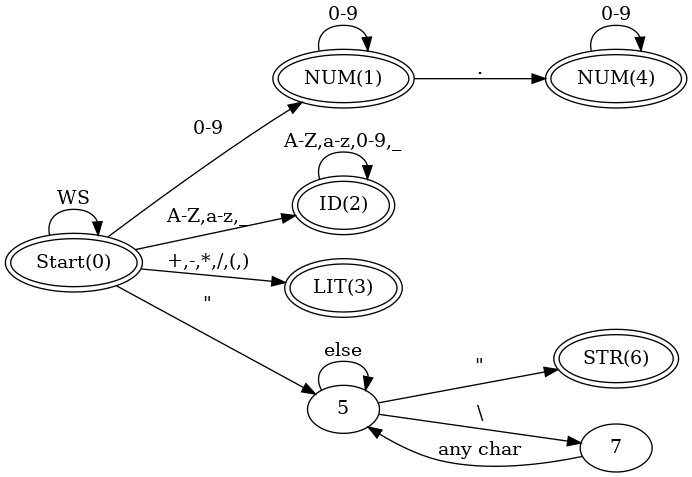

# LispParser

Implement a parser Lisp(ish) in CSharp. 

For this project you will write `lispish.exe`, an parser for a simple LISP-like language. 

Your program will read a LISP expression and print the parse tree.  

> NOTE:  I created a video demonstrating me solving a similar problem in c-sharp at [this link](https://youtu.be/jgQONmpCQ-c).  The files are in this repo. 

# Grammar
Consider the following grammer for a simplified scheme grammar

```
<Program> ::= {<SExpr>}
<SExpr> ::= <Atom> | <List>
<List> ::= () | ( <Seq> )
<Seq> ::= <SExpr> <Seq> | <SExpr>
<Atom> ::= ID | INT | REAL | STRING
```
 
# Token Types in Regex

- `LITERAL` = [[\\(\\)]](https://regex101.com/r/YTsgaN/1)
- `REAL` = [[+-]?[0-9]*\\.[0-9]+](https://regex101.com/r/Zneyy2/1)
- `INT` = [[+-]?[0-9]+](https://regex101.com/r/iXVsuF/1)
- `STRING` = ["(?>\\\\.|[^\\"])*"](https://regex101.com/r/NvtTXK/1).  Multiline strings are not allowed. 
- `ID` = [[^\s"\(\)]+](https://regex101.com/r/PeL1IV/1/)
- Anything else other than whitespace is an error ( `INVALID`)

# Diagram

