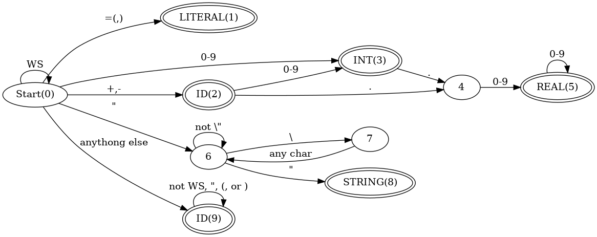

# LispParser

A parser written in C# that handles a simple form of a lisp like language. The parser outputs a sequence of tokens followed by their lexeme as well as a parse tree.

# Grammar
This is the basic grammar used for the lisp-like language

```
<Program> ::= {<SExpr>}
<SExpr> ::= <Atom> | <List>
<List> ::= () | ( <Seq> )
<Seq> ::= <SExpr> <Seq> | <SExpr>
<Atom> ::= ID | INT | REAL | STRING
```
 
# Token Types in Regex
These are the tokens represented as regex

- `LITERAL` = [[\\(\\)]](https://regex101.com/r/YTsgaN/1)
- `REAL` = [[+-]?[0-9]*\\.[0-9]+](https://regex101.com/r/Zneyy2/1)
- `INT` = [[+-]?[0-9]+](https://regex101.com/r/iXVsuF/1)
- `STRING` = ["(?>\\\\.|[^\\"])*"](https://regex101.com/r/NvtTXK/1).  Multiline strings are not allowed. 
- `ID` = [[^\s"\(\)]+](https://regex101.com/r/PeL1IV/1/)
- Anything else other than whitespace is an error ( `INVALID`)

# Diagram

